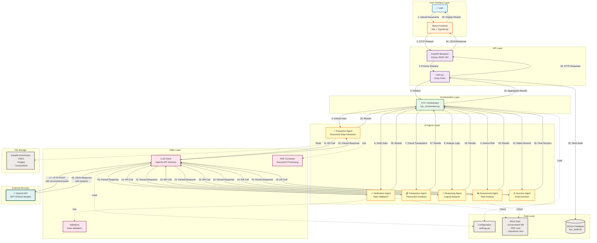

# KYC/AML AI Agents - System Architecture

## High-Level Architecture Diagram

```mermaid
graph TB
    subgraph "User Interface Layer"
        User[👤 User]
        Frontend[React Frontend<br/>Vite + TypeScript]
    end

    subgraph "API Layer"
        FastAPI[FastAPI Backend<br/>Python REST API]
        MainPy[main.py<br/>Entry Point]
    end

    subgraph "Orchestration Layer"
        Orchestrator[KYC Orchestrator<br/>kyc_orchestrator.py]
    end

    subgraph "AI Agents Layer"
        ExtractionAgent[📄 Extraction Agent<br/>Document Data Extraction]
        VerificationAgent[✓ Verification Agent<br/>Data Validation]
        TransactionAgent[💰 Transaction Agent<br/>Transaction Analysis]
        ReasoningAgent[🧠 Reasoning Agent<br/>Logical Analysis]
        AssessmentAgent[📊 Assessment Agent<br/>Risk Analysis]
        DecisionAgent[⚖️ Decision Agent<br/>Final Decision]
    end

    subgraph "Utility Layer"
        LLMClient[LLM Client<br/>OpenAI API Interface]
        PDFConverter[PDF Converter<br/>Document Processing]
        Validators[Validators<br/>Data Validation]
    end

    subgraph "External Services"
        OpenAI[🤖 OpenAI API<br/>GPT-4/Vision Models]
    end

    subgraph "Data Layer"
        Config[Configuration<br/>settings.py]
        MockData[Mock Data<br/>- Government DB<br/>- PEP Lists<br/>- Sanctions Lists]
        Database[(SQLite Database<br/>kyc_audit.db)]
    end

    subgraph "File Storage"
        Samples[Sample Documents<br/>- PDFs<br/>- Images<br/>- Transactions]
    end

    %% User Flow
    User -->|1. Upload Documents| Frontend
    Frontend -->|2. HTTP Request| FastAPI
    FastAPI -->|3. Process Request| MainPy
    MainPy -->|4. Initialize| Orchestrator

    %% Orchestration Flow
    Orchestrator -->|5. Extract Data| ExtractionAgent
    Orchestrator -->|6. Verify Data| VerificationAgent
    Orchestrator -->|7. Check Transactions| TransactionAgent
    Orchestrator -->|8. Analyze Logic| ReasoningAgent
    Orchestrator -->|9. Assess Risk| AssessmentAgent
    Orchestrator -->|10. Make Decision| DecisionAgent

    %% Agent to LLM Flow
    ExtractionAgent -->|11. API Call| LLMClient
    VerificationAgent -->|12. API Call| LLMClient
    TransactionAgent -->|13. API Call| LLMClient
    ReasoningAgent -->|14. API Call| LLMClient
    AssessmentAgent -->|15. API Call| LLMClient
    DecisionAgent -->|16. API Call| LLMClient

    %% LLM to OpenAI Flow
    LLMClient -->|17. HTTP POST<br/>with structured prompts| OpenAI
    OpenAI -->|18. JSON Response<br/>with analysis| LLMClient

    %% Response Flow Back
    LLMClient -->|19. Parsed Response| ExtractionAgent
    LLMClient -->|20. Parsed Response| VerificationAgent
    LLMClient -->|21. Parsed Response| TransactionAgent
    LLMClient -->|22. Parsed Response| ReasoningAgent
    LLMClient -->|23. Parsed Response| AssessmentAgent
    LLMClient -->|24. Parsed Response| DecisionAgent

    %% Results Flow
    ExtractionAgent -->|25. Results| Orchestrator
    VerificationAgent -->|26. Results| Orchestrator
    TransactionAgent -->|27. Results| Orchestrator
    ReasoningAgent -->|28. Results| Orchestrator
    AssessmentAgent -->|29. Results| Orchestrator
    DecisionAgent -->|30. Final Decision| Orchestrator

    %% Response to User
    Orchestrator -->|31. Aggregated Results| MainPy
    MainPy -->|32. Store Audit| Database
    MainPy -->|33. HTTP Response| FastAPI
    FastAPI -->|34. JSON Response| Frontend
    Frontend -->|35. Display Results| User

    %% Utility Connections
    ExtractionAgent -.->|Use| PDFConverter
    ExtractionAgent -.->|Read| Samples
    VerificationAgent -.->|Use| Validators
    VerificationAgent -.->|Check| MockData
    AssessmentAgent -.->|Check| MockData
    Orchestrator -.->|Load| Config
    LLMClient -.->|Load| Config

    %% Styling
    classDef userClass fill:#e1f5ff,stroke:#01579b,stroke-width:2px
    classDef frontendClass fill:#fff3e0,stroke:#e65100,stroke-width:2px
    classDef apiClass fill:#f3e5f5,stroke:#4a148c,stroke-width:2px
    classDef orchestratorClass fill:#e8f5e9,stroke:#1b5e20,stroke-width:2px
    classDef agentClass fill:#fff9c4,stroke:#f57f17,stroke-width:2px
    classDef utilClass fill:#fce4ec,stroke:#880e4f,stroke-width:2px
    classDef externalClass fill:#e0f2f1,stroke:#004d40,stroke-width:3px
    classDef dataClass fill:#efebe9,stroke:#3e2723,stroke-width:2px

    class User userClass
    class Frontend frontendClass
    class FastAPI,MainPy apiClass
    class Orchestrator orchestratorClass
    class ExtractionAgent,VerificationAgent,TransactionAgent,ReasoningAgent,AssessmentAgent,DecisionAgent agentClass
    class LLMClient,PDFConverter,Validators utilClass
    class OpenAI externalClass
    class Config,MockData,Database,Samples dataClass
```

