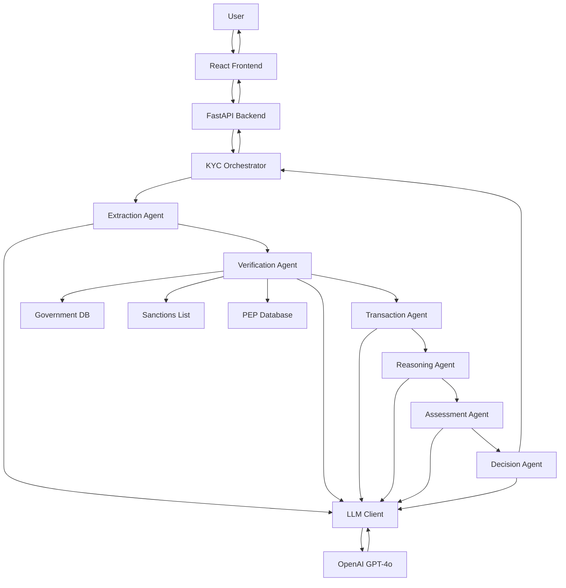
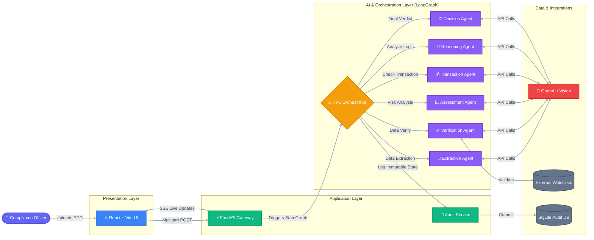

# KYC/AML Multi-Agent System Architecture

## System Architecture Diagram

## Data Flow

**User to OpenAI API and Back**

1. User uploads document via React frontend
2. Frontend sends HTTP POST to FastAPI
3. API initializes KYC Orchestrator
4. Orchestrator executes LangGraph workflow
5. Six agents process sequentially
6. Each agent calls OpenAI GPT-4o via LLM Client
7. Verification queries external databases
8. OpenAI returns structured JSON
9. Results stream back via SSE
10. Frontend displays real-time updates

## Technology Stack

- Frontend: React, TypeScript, Vite
- API: FastAPI, Python, SSE
- Orchestration: LangGraph, LangChain
- LLM: OpenAI GPT-4o
- Database: SQLite
- Agents: 6 specialized agents

## Key Features

- Real-time SSE streaming
- Human-in-the-Loop (HITL)
- State checkpointing
- Audit trail
- Vision API support
- Structured output validation
